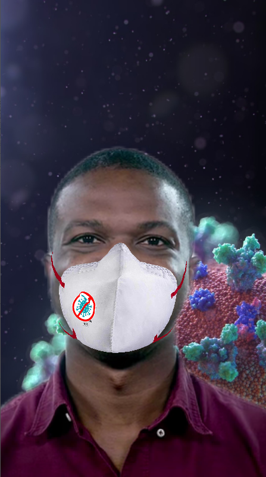

# Spark AR Coronavirus themed face effect

## Steps to open project
- Install Spark AR studio
- Click File menu and click open and select the file with extension .arproj
- Voila! You can edit it now or use as it is

## Sample Image
